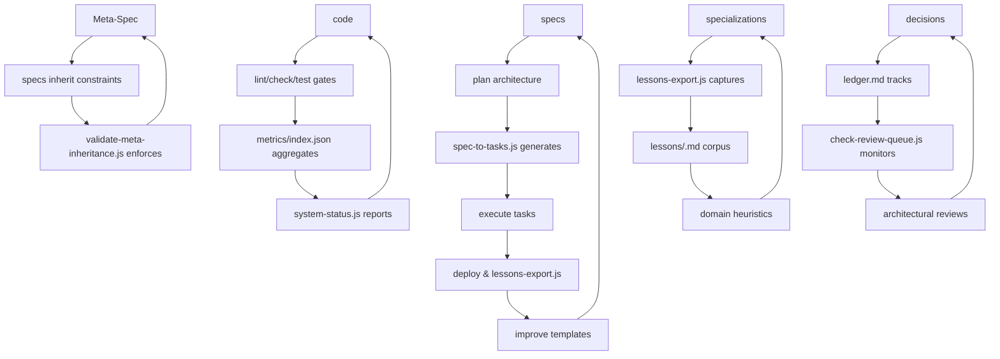

# **MultiCRM Workflow Report 2025**

```
version: 2025.10.16
last_audit: 2025-10-16
health_score: 83.5/100
drift_index: 12% (moderate entropy - review review-queue.txt for overdue decisions)
```

---

## **🏛️ Cybernetic Operating System for CRM Specialization**

**Philosophy**: Specification-Driven Development (SDD) creates institutional autonomy where governance tools self-validate and improve, reducing entropy through automated enforcement. "Specifications define truth. Code merely fulfills it."

**Workflow at a Glance**:
1. Clone template → Instant production-ready CRM foundation
2. Specify domain → Document requirements following meta-spec inheritance
3. Plan architecture → Design following constitutional constraints
4. Generate tasks → Auto-compile executable breakdown from plans
5. Implement & deploy → Quality-gated development with automated validation

**Commands Cheat Sheet**:

| Action | Command | Notes |
|--------|---------|-------|
| **System Health** | `node scripts/system-status.js` | Ecosystem health score and overview |
| **Generate Tasks** | `node scripts/spec-to-tasks.js <plan.md>` | Architecture → executable tasks |
| **Validate Compliance** | `node scripts/validate-meta-inheritance.js <spec.md>` | Constitutional inheritance check |
| **Check Reviews** | `node scripts/check-review-queue.js` | Overdue decision monitoring |
| **Export Lessons** | `node scripts/lessons-export.js <domain>` | Domain knowledge capture |

**Where to Start**:
- **New Contributor**: Review ¶Quick Orientation above, then proceed to §Constitutional Foundation
- **Domain Specialist**: Clone template using §Domain Specialization workflow
- **Platform Engineer**: Monitor §Quality Assurance Pipeline gates
- **Keeper Role**: Follow §Keeper Responsibilities maintenance protocols

**[Reference Mode ↓](#reference-mode-full-workflow-details) for complete technical documentation**

---

# **Reference Mode: Full Workflow Details**

## **📋 Complete Development Workflow**

### **Phase 1: Environment Preparation** (30 minutes)
```bash
git clone <repository-url>
cd multicrm
npm install && npm run type-check
node scripts/system-status.js  # Verify: Health Score §Health Dashboard
```
For tool documentation: see §Observability Tools.

### **Phase 2: Domain Conception**
Review §Non-Negotiables (§Meta-Spec Charter) against requirements. For template cloning: see §Domain Operations.

### **Phase 3: Specification-Driven Development**
Execute SDD phases (§SDD Workflow) with §Quality Gates enforcement.

### **Phase 4: Deployment & Scaling**
Push to main for auto-deploy (§Deployment Architecture).

### **Phase 5: Post-Build Intelligence**
Capture domain lessons using §Post-Build Reflection tools.

## **⚖️ Constitutional Foundation**

### **Living Constitution** (`/constitution.md`)
Hard prohibitions enforced by pre-commit validation (§Observability Tools).

**Revision Protocol**: Constitutional changes require:
1. Rationale documentation in `/decisions/ledger.md` with HIGH impact score
2. Meta-spec version increment (`/meta/meta.md`)
3. Validation via `node scripts/check-review-queue.js`

That prevents governance fossilization while maintaining stability.

### **Meta-Spec Charter** (`/meta/meta.md`)
Auto-inherited constraints (§SDD Workflow) defining value proposition, non-negotiables, and stakeholder archetypes.

## **🔄 Cybernetic Feedback Loops**

### **System Architecture Diagram**


## **👁️ Observability & Governance Tools**

### **Health Dashboard** (`/metrics/index.json`)
Rolling averages for quality gates (§Quality Gates) generated by CI/CD updates.

### **Decision Ledger** (`/decisions/ledger.md`)
Chronological tracking (§Governance Tools) with impact scores and revisit dates.

### **Knowledge Index** (`/docs/_index.md`)
Single-entry locator (§Constitutional Foundation).

### **Review Queue** (`review-queue.txt`)
Prioritized overdue decisions (§Feedback Loops).

## **🎯 Domain Specialization Operations**

### **Template Cloning Pattern**
```bash
cp -r multicrm <domain>-crm
cd <domain>-crm/src/shared/src
# Extend types.ts with domain entities
```

For full workflow: reference §SDD Phases.

Benefits: 90%+ code reuse, maintained type safety.

## **🛡️ Quality Assurance Pipeline**

### **Automated Quality Gates**
| Stage | Tool | Enforces | Metrics |
|-------|------|----------|---------|
| Pre-commit | `validate-meta-inheritance.js` | Constitutional compliance | Inheritance violations |
| Type Check | `tsc --strict` | Zero `any` types | Compilation failures |
| Lint | `eslint` | Code standards | Error counts |
| Test | `jest --coverage` | 90%+ coverage | Coverage percentages |
| Bundle | `vite build` | Size limits | Bundle metrics |
| Health | `system-status.js` | Ecosystem coherence | Health scores |

For enforcement mechanics: see §Feedback Loops.

### **Constitutional Enforcement Metrics**
- TypeScript strict mode: 100% compliance required
- Schema-per-tenant: Only permitted architecture
- Test-first development: Mandatory approach
- Zero specification variance: Exact implementation required

### **Deployment Architecture**
Zero-configuration hosting: Render backend, Cloudflare Pages frontend. $0 perpetual cost.

## **👤 Keeper Responsibilities (Maintenance Role)**

Define system stewardship to prevent automation fogging:

### **Weekly Protocols**
- Execute `node scripts/system-status.js` and review `/metrics/index.json`
- Monitor drift_index (<15% = green, 15-30% = yellow, >30% = red alert)

### **Quarterly Protocols**
- Run `node scripts/check-review-queue.js` and update `/decisions/ledger.md`
- Curation: HIGH impact decisions require immediate review (see §Review Queue)
- MED impact: Allowed one cycle grace period
- LOW impact: Archive after two quarters without activity

### **Revision Protocols**
- Approve meta-spec changes following §Living Constitution clause
- Ratify constitutional amendments with full ledger documentation
- Maintain version control metadata accuracy

### **Knowledge Curation**
- Publish `/lessons/<domain>.md` post-specialization
- Update `/docs/_index.md` with new governance artifacts
- Audit documentation accuracy against §Health Dashboard metrics

**Keeper Mission**: Steward autonomy while preventing entropy, ensuring cybernetic loops remain operative.

## **🔀 Evolution Boundaries**

MultiCRM's evolutionary scope preserves ideological integrity while allowing technical growth:

### **Within Scope (Free Innovation Zones)**
- **Meta-tool improvements**: Enhance spec-to-tasks.js, validate-meta-inheritance.js, system-status.js automation
- **Constitutional parameter tuning**: Adjust quality gates (test coverage thresholds, bundle size limits)
- **New domain templates**: Create school-crm, hospital-crm, hotel-crm specializations following established patterns
- **CI/CD automation**: Add deployment optimizations, monitoring integrations, performance tuning

### **Out of Scope (Ideological Core - Forbidden Changes)**
- **Core philosophy**: "Specifications define truth. Code merely fulfills it."
- **Multi-tenant architecture**: PostgreSQL schema-per-tenant model only
- **TypeScript strict mode**: Zero `any` types requirement
- **SDD workflow**: /specify → /plan → /tasks → code progression
- **Test-first mandate**: Red-Green-Refactor enforcement
- **Template cloning pattern**: No feature-branching or forking variations

These boundaries prevent "automation fogging" while enabling perpetual improvement of the cybernetic operating system.

## **🧠 Cognitive Architecture**

MultiCRM operates as a layered cognitive system, externalizing human reasoning into machine-trackable processes:

| Layer | Function | Responsibility | Artifacts |
|-------|----------|----------------|-----------|
| **Human Layer** | Intent Definition | Define business requirements and verify outputs | PRD specifications, domain requirements |
| **Reasoning Layer** | Structure Generation | Convert intent into structured specifications | spec.md, plan.md, data-model.md, contracts/ |
| **Execution Layer** | Code Synthesis | Transform specifications into implementation | Source code matching contracts exactly |
| **Persistence Layer** | Truth Storage | Store all specifications and decisions durably | Markdown exports, decision ledger, metrics |
| **Feedback Layer** | Continuous Improvement | Revalidate constraints and capture lessons | Review queues, health monitoring, lessons export |

This cognitive externalization creates institutional maturity: human judgment codified into automated quality gates, human coordination replaced by modular architecture, human memory externalized into machine-trackable specifications.

---

## **🎉 Why It Works (Philosophical Appendix)**

MultiCRM achieves institutional maturity through cognitive externalization: replacing human memory with machine-trackable specifications, human judgment with automated quality gates, human coordination with modular architecture.

Each meta-tool serves as a feedback node in a cybernetic system—governance tools enforce stability, productivity tools reduce friction, wisdom tools accumulate learning, observability tools provide awareness.

Result: Living operating system that develops itself, maintains coherence across enterprise CRM specializations, and continuously improves through structured self-reflection.

**From reactive development to institutional autonomy.**
